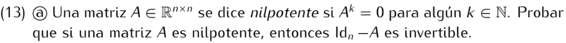

```
Supongamos Id-A no es invertible, luego A-Id no es invertible y por lo tanto det(A-Id) = 0,
lo cuál nos dice que el polinomio característico tiene a 1 como raíz. Por lo tanto, 1 es autovalor de A.
Sea V autovector con autovalor 1, es decir v ≠ 0 y Av = v.
Entones:
Aⁿ(v) = Aⁿ⁻¹(Av) = Aⁿ⁻¹v = Aⁿ⁻²(Av) = Aⁿ⁻²v = ... = Av = v

Es decir, si suponemos que Id-A no es invertible, obtenemos un v ≠ 0 tal que Aⁿv = v ≠ 0.
Por lo tanto Aⁿ ≠ 0. Absurdo. Luego Id - a es invertible.
```