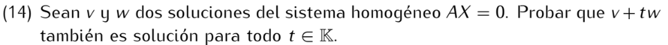

```
Como v y w son soluciones de Ax = 0, tenemos que Av = 0 y Aw = 0.
Luego, por las propiedades que cumple el producto y suma de matrices:
A(v + tw) = Av + A(tw) = 0 + t(Aw) = 0 + t0 = 0 + 0 = 0.
Es decir, v + tw es solución de Ax = 0.
```