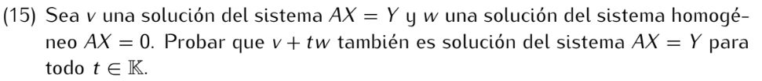

```
Como v es solución de AX = Y, tenemos que Av = Y.
Al ser w solución del sistema AX = 0, se cumple Aw = 0.

Luego, por las propiedades que cumple el producto y suma de matrices:
A(v + tw) = Av + A(tw) = Y + t(Aw) = Y + 0 = Y

Es decir, v + tw es solución de AX = Y.
```