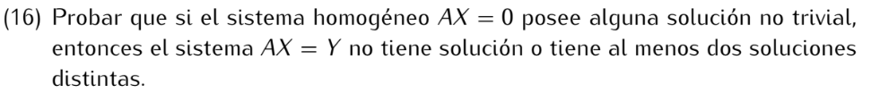

```
Si AX = Y no tiene solución, listo, pues es uno de los casos.
Si AX = Y tiene solución, sea entonces w alguna solución del sistema, es decir, Aw = Y.
Por hipótesis AX = 0, tiene soluciones no triviales, es decir, existe v ≠ 0 tal que Av = 0.

Por el ejercicio 15: v + w es solución del sistema AX = Y, como v ≠ 0, los vectores w y v+w
son distintos y ambos son solución del sistema AX = Y.

Observación: En realidad, la existencia de una solución w del sistema AX = Y implica la existencia
de infinitas soluciones, pues por el ejercicio 15 los vectores w+tv son soluciones de AX = Y ∀t∈K.
```