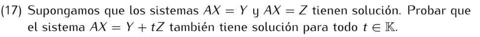

```
Sea v solución de AX = Y, es decir Av = Y y
sea solución del sistema AX = Z, es decir Aw = Z.

Entonces, dado t∈K:
A(v + tw) = Av + Atw = Y + tAw = Y + tZ

Es decir, v + tw es solución de AX = Y + tZ
```