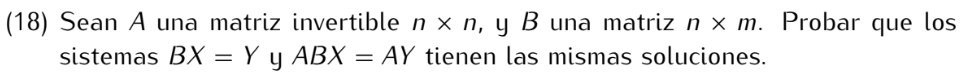

```
v es solución de BX = Y => Bv = Y
                        => ABv = AY
                        => v es solución de ABX = AY

Ésta "ida" vale para cualquier matriz A, sea invertible o no.
Para la vuelta debemos utilizar la existencia de A⁻¹:

v es solución de ABX = AY => ABv = AY
                          => A⁻¹ABv = A⁻¹AY
                          => IdBv = IdY
                          => Bv = Y
                          => v es solución de BX = Y
```