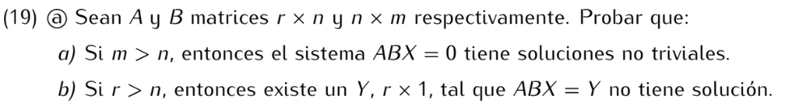

```
a) Como m > n el sistema BX = 0 tiene más incógnitas que ecuaciones, 
por lo tanto tiene soluciones no triviales.
Sea v ≠ 0 solución de Bx = 0, es decir Bv = 0.
Entonces ABv = A(Bv) = A0 = 0, por lo tanto
v es solución del sistema ABX = 0.
```
```
b) Sea P matriz r x r inversible tal que PA es MERF.
Como r > n, la matriz PA tiene más filas que columnas
y como es MERF la última fila debe ser nula.

Ahora bien, por el ejercicio 18, los sistemas PABX = PY y
ABX = Y tiene las mismas soluciones, por lo tanto si existe 
Y tal que PABX = PY no tiene solución, entonces el sistema 
ABX = Y tampoco tiene solución.

Demostremos, entonces, que existe Y tal que PABX = PY no tiene solución:
como PA tiene la última fila nula, PABX también tiene la última fila nula.
Sea e la matriz r x 1 con 1 en la coordenada r y 0 en las otras coordenadas.
Entones e = P(P⁻¹e) tiene la última fila no nula, por lo tanto 
el sistema PABX = P(P⁻¹e) no tiene solución y, por lo dicho anteriormente,
el sistema ABX = P⁻¹e no tiene solución.
```