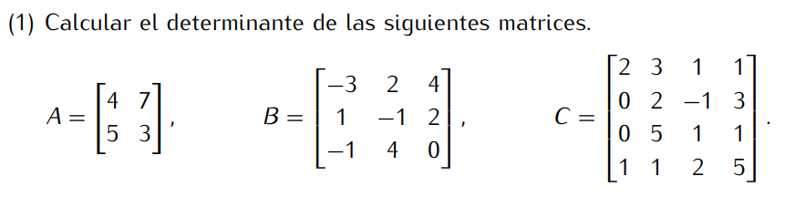

```
det(A) = 4*3 - 7*5 = 12 - 35 = -23
```
```
det(b) = (-3)*(-1)*0 + 2*2*(-1) + 4*1*4 - 4*(-1)*(-1) - 2*1*0 - (-3)*2*4
       = 0 + (-4) + 16 - 4 - 0 - (-24)
       = 32
```
```
det(c) = 2*A(1|1) - 0*A(1|2) + 0*A(1|3) - 1*A(1|4)
       = 2*(2*1*5 + (-1)*1*1 + 3*5*2 - 3*1*1 - (-1)*5*5 - 2*1*2)
         - 1*(3*(-1)*1 + 1*3*5 + 1*2*1 - 1*(-1)*5 - 1*2*1 - 3*3*1)

       = 2*(10 + (-1) + 30 - 3 - (-25) - 4) - (-3 + 15 + 2 - (-5) - 2 - 9)
       = 2*57 - 8
       = 114 - 8
       = 106
```