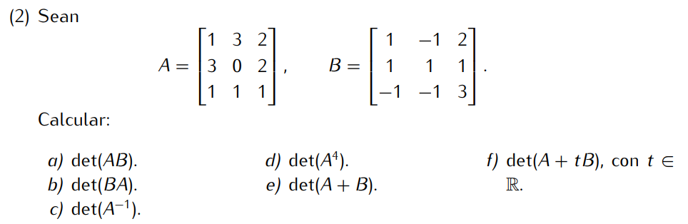

```
Primero calculamos det(A) y det(B)
det(A) = = 0 + 6 + 6 - 0 - 9 - 2
       = 1

det(B) = 3 + 1 + (-2) - (-2) - (-3) - (-1)
       = 8
```

```
a) det(AB) = det(A)*det(B) = 1*8 = 8
b) det(BA) = det(B)*det(A) = 8*1 = 8
c) det(A⁻¹) = 1 / det(A) = 1/1 = 1
d) det(A⁴) = (det(A))⁴ = 1⁴ = 1
```
```
e) det(A+B) 
primero calculo A+B
A+B = |2 2 4|
      |4 1 3|
      |0 0 4|

det(A+B) = 2*1*4 - 2*4*4
         = 8 - 32
         = -24
```
```
f) det(A+tB)
calculo A+tB
A+tB = |1+t  3-t  2-2t|
       |3+t   t   2+t |
       |1-t  1-t  1+3t|

det(A+tB) = 8t³ - t² - 32t + 1
```