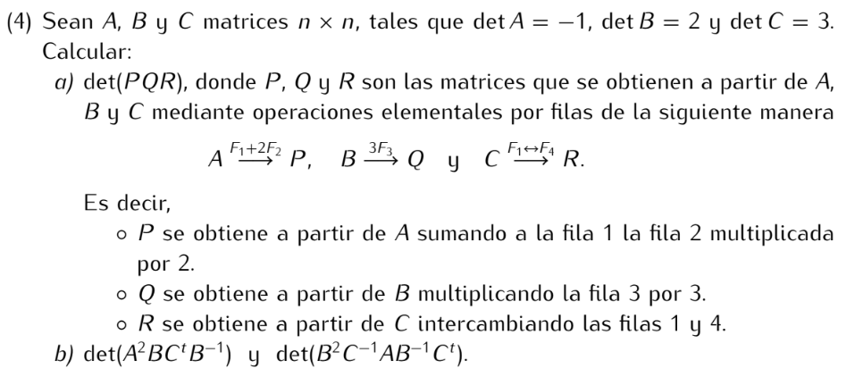
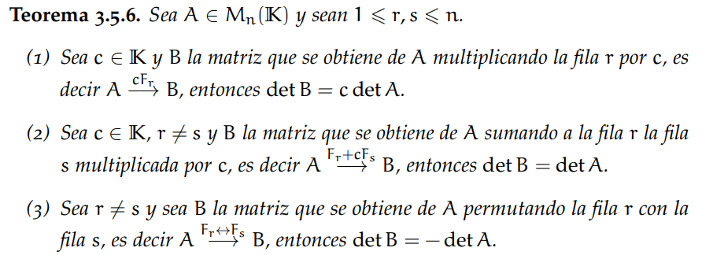

Recordemos:



```
a) det(PQR)

La operación elemental f1 + 2f2 no afecta al determinante, por lo tanto det(P) = det(A) = -1

Con la operación elemental 3F3 se obtiene una matriz cuyo determinante es 3 veces el determinante de la matriz original,
luego det(Q) = 3det(B) = 3*2 = 6

Con la operación elemental F1<->F4 se obtiene una matriz cuyo determinante es el inverso de la matriz original,
luego det(R) = -det(C) = -3

finalmente, det(PQR) = (-1)*6*(-3)
                     = 18
```

```
b) det(A²BCⁿB⁻¹) = det(A²) * det(B) * det(Cⁿ) * det(B⁻¹)
                 = det(A)² * det(B) * det(Cⁿ) * det(B)⁻¹
                 = (-1)² * 2 * 3 * (1/2)
                 = (2*3) / 2
                 = 3

   det(B²C⁻¹AB⁻¹Cⁿ) = det(B²) * det(C⁻¹) * det(A) * det(B⁻¹) * det(Cⁿ)
                    = det(B)² * det(C)⁻¹ * det(A) * det(B)⁻¹ * det(Cⁿ)
                    = 2² * 3⁻¹ * (-1) * 2⁻¹ * 3
                    = -2
```