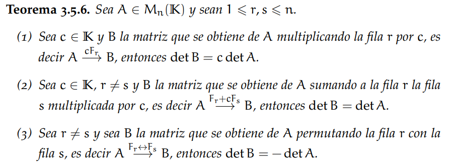

```
A simple vista podemos notar que B y C son equivalentes por filas a A:

A = |x  y  z|             |2x 2y 2x|           |2x  2y 2z| = B
    |3  0  2| - f1+2f3 -> | 3  0  2| - f2/2 -> |3/2  0  1|
    |1  1  1|             | 1  1  1|           | 1   1  1|

A = |x  y  z| - f3+f1 -> |  x    y    z | = C
    |3  0  2|   f2+3f1   |3+3x  3y  2+3z|
    |1  1  1|            | x+1  y+1  z+1|
```

Recordemos:



```
Si det(A) = 5, por la operación f1+2f3 tenemos que
det(B) = det(A) * 2

y por f2/2, tenemos que
det(B) = det(A) * 2 * (1/2)

por lo tanto, det(B) = det(A) = 5
```
```
En cuanto a det(C), cómo las operaciones de sumar a una fila un múltiplo de otra no cambian
el determinante, obtenemos que det(C) = det(A) = 5
```