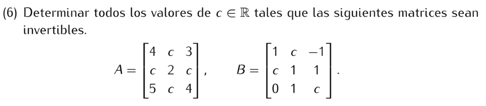

**Una matriz A es invertible si y solo si det(A) ≠ 0**

```
det(A) = 4*2*4 + c*c*5 + 3*c*c - 3*2*5 - c*c*4 - 4*c*c
       = 32 + 5c² + 3c² - 30 - 4c² - 4c²
       = 2

Por lo tanto A es invertible ∀c ∈ R.
```
```
det(B) = 1*1*c + c*1*0 + (-1)*c*1 - (-1)*1*0 - c*c*c - 1*1*1
       = c - c - c³ - 1
       = -c³ - 1

Por lo tanto B es invertible si c ≠ -1.
```