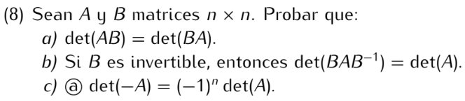

```
det(AB) = det(A) * det(B) = det(B) * det(A) = det(BA)
```
```
det(BAB⁻¹) = det(B) * det(A) * det(B⁻¹)
           = det(B) * det(B⁻¹) * det(A)
           = det(B) * det(B)⁻¹ * det(A)
           = 1 * det(A)
           = det(A)
```
```
Sea Id la matriz identidad n x n.
Observar que -A = (-Id)A.
Luego, det(-A) = det((-Id)A) = det(-Id) * det(A).
Como -Id es una matriz diagonal con -1 en la diagonal,
entonces det(-Id) = (-1)ⁿ.
Por lo tanto, det(-A) = (-1)ⁿ * det(A)
```